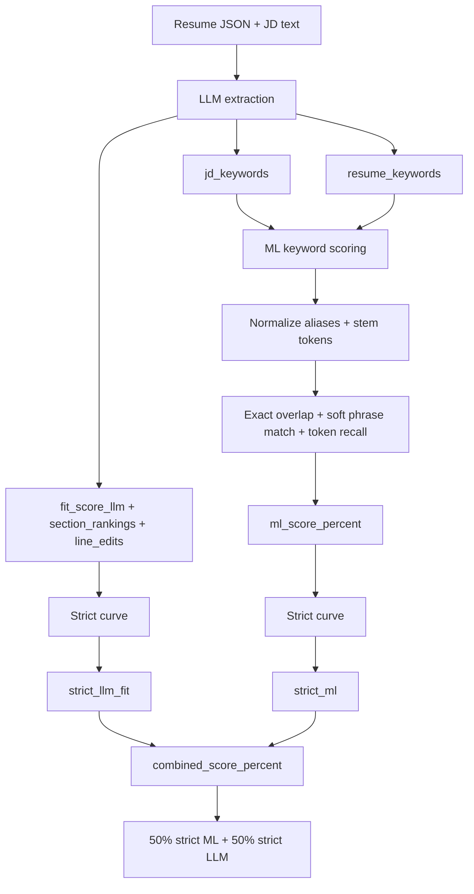

# Better Resume Builder

Parse a CV and a job description into structured JSON, run **match analysis** (ML keyword overlap + **LLM** fit + optional TF–IDF reference), and get **line-level edit suggestions** grounded in your resume.

## Tech stack

- **Frontend**: React, Vite, Tailwind v4, Zustand, Monaco, `react-pdf` / pdf.js, html2canvas + jsPDF.
- **Backend**: FastAPI, Google GenAI (Gemini), scikit-learn (TF–IDF).

---

## Run locally (step by step)

### What you need installed

| Tool | Notes |
|------|--------|
| **Python 3.12+** | For the API (`python`, `pip`). A virtualenv is recommended. |
| **Node.js 20+** | For the web UI (`node`, `npm`). |
| **Gemini API key** | From [Google AI Studio](https://aistudio.google.com/apikey) (free tier available). |

You will run **two terminals**: one for the backend, one for the frontend.

---

### Terminal 1 — start the API

```bash
cd backend
pip install -r requirements.txt
PYTHONPATH=. uvicorn gateway.main:app --reload --host 127.0.0.1 --port 8000
```

Leave this running. Check [http://127.0.0.1:8000/docs](http://127.0.0.1:8000/docs) for OpenAPI.

---

### Terminal 2 — start the web app

```bash
cd frontend
npm install
npm run dev
```

Leave this running. Open [http://127.0.0.1:5173](http://127.0.0.1:5173).

---

### How to give the app a Gemini key (pick one)

**Option A — Session key (default, good for trying the repo quickly)**

1. Do **not** put `GEMINI_API_KEY` in `.env` (or leave session-only behavior as default).
2. When the app opens, use **Add your Gemini API key** and paste your key. It stays in this **browser tab only** (session storage) and is sent as `X-Gemini-Api-Key`.
3. No extra frontend flags needed.

**Option B — `.env` file on your machine (server holds the key)**

1. Copy **`.env.example`** to **`.env`** in the **repo root** or in **`backend/`** (either location works in development).
2. In `.env`, set:
   - `GEMINI_SESSION_ONLY=false`
   - `GEMINI_API_KEY=...` (or `GOOGLE_API_KEY=...`)
3. **Restart** the backend (Terminal 1) so it reloads the file.
4. Start the frontend with the gate skipped so you are not forced to paste the key again in the browser:

   ```bash
   cd frontend
   VITE_SKIP_GEMINI_KEY_GATE=true npm run dev
   ```

   Alternatively, keep plain `npm run dev` and paste the same key in the first-run modal; the backend will still prefer `.env` when `GEMINI_SESSION_ONLY=false`.

---

### Optional local tweaks

| Goal | What to do |
|------|------------|
| API on another host/port | `VITE_API_BASE_URL=http://127.0.0.1:9000 npm run dev` (default if unset: `http://localhost:8000`) |
| Skip loading any `.env` on the server | `SKIP_DOTENV=true` before `uvicorn` (advanced) |

---

## Production deployment

**Full instructions (Docker, env vars, Kubernetes outline, frontend build) are in plain text:**

**[`DEPLOY.txt`](DEPLOY.txt)**

---

## Features (overview)

### Backend

- Resume ingestion (PDF/Word → JSON + outline), JD ingestion (paste or file), **`POST /analyze-resume`** (LLM + ML + lexical reference).

### Frontend

- Job vs “What to change” workspace, match summary, annotated preview + PDF export, dark/light theme, Monaco JSON editor for raw resume data.

---

## Scoring Diagram



### ML score details

- Input is **LLM-extracted keyword lists** (`jd_keywords`, `resume_keywords`), not raw full-text cosine only.
- Matching is **not just word-for-word**:
  - Alias normalization (`js`→`javascript`, `k8s`→`kubernetes`, etc.)
  - Lightweight stemming (`optimized` vs `optimization`)
  - Soft phrase similarity + token-level coverage
- Blend favors JD-side coverage to avoid false zero while still penalizing missing must-haves.

### LLM scoring instructions (used in prompt)

- `fit_score_llm` and each section `relevance_score` use a strict rubric:
  - 90+ only near-perfect JD alignment
  - strong but imperfect candidates often 60s–low 80s
  - missing must-have tools/themes lowers score materially
- Weighted checklist for `fit_score_llm`:
  - Must-have skills/tools coverage (40%)
  - Domain/role alignment and responsibility match (25%)
  - Evidence of impact/ownership in bullets (20%)
  - Seniority/scope consistency (15%)
- `line_edits` must propose JD-aligned rewrites when helpful, while staying grounded in facts already in the resume.

---

## Branches

- **`development`** — day-to-day feature work.
- **`deployment`** — release line aligned with production-style configuration (see **`DEPLOY.txt`**).

---

## Microservices (advanced)

Default local mode is **`GATEWAY_MODE=embedded`**. For multiple processes, use **`GATEWAY_MODE=proxy`** and set `INGESTION_SERVICE_URL`, `JD_SERVICE_URL`, `ANALYSIS_SERVICE_URL`. Commands and ports are summarized in **`DEPLOY.txt`** and the Compose files under **`backend/deploy/`**.

```bash
# Example: workers + proxy gateway (from backend/, PYTHONPATH=.)
PYTHONPATH=. uvicorn services.ingestion.app:app --port 8001
# … jd 8002, analysis 8003 …
GATEWAY_MODE=proxy \
  INGESTION_SERVICE_URL=http://127.0.0.1:8001 \
  JD_SERVICE_URL=http://127.0.0.1:8002 \
  ANALYSIS_SERVICE_URL=http://127.0.0.1:8003 \
  PYTHONPATH=. uvicorn gateway.main:app --port 8000
```
