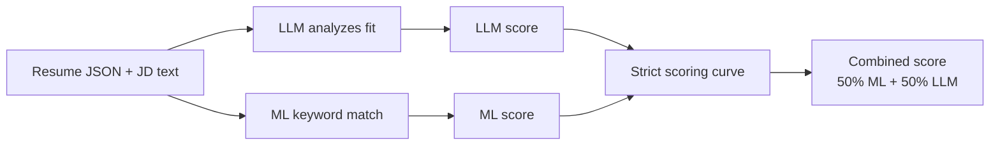

# Better Resume Builder

Upload a resume, add a job description, and get:
- match scores (Combined, ML, LLM)
- missing JD keywords you can click to copy
- grounded line-by-line rewrite suggestions

## Quick start

### 1) Start backend
```bash
cd backend
pip install -r requirements.txt
PYTHONPATH=. uvicorn gateway.main:app --reload --host 127.0.0.1 --port 8000
```

### 2) Start frontend
```bash
cd frontend
npm install
npm run dev
```

Open `http://127.0.0.1:5173`.

## Gemini key options

- **Session key (recommended for local testing):** use the in-app key panel. Key is kept only in browser session storage and sent as `X-Gemini-Api-Key`.
- **Server key:** set `GEMINI_API_KEY` (or `GOOGLE_API_KEY`) in environment, then restart backend.

## Core endpoints

- `POST /parse-resume`
- `POST /parse-jd`
- `POST /parse-jd-text`
- `POST /analyze-resume`
- `POST /optimize-cv`

Open API docs at `http://127.0.0.1:8000/docs`.

## How scoring works (simple)



- **LLM score:** holistic fit (skills, role alignment, impact evidence).
- **ML score:** overlap between JD keywords and resume keywords (with soft matching, not exact-only).
- **Combined score:** average of strict ML and strict LLM scores.

## Branches

- `v2`: current working branch
- `development`: feature iteration
- `deployment`: deployment-oriented config

## Deploy

Use deployment assets in:
- `DEPLOY.txt`
- `backend/deploy/`
